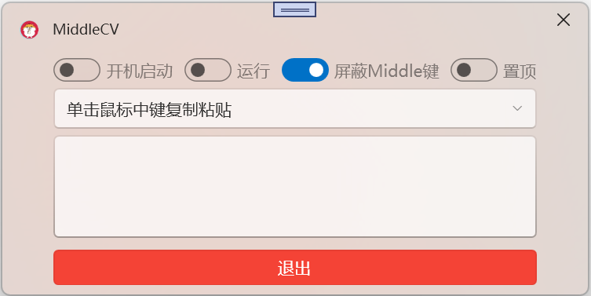

# MiddleCV - 按下鼠标中键即可快捷复制粘贴文字

## 使用教程

1. 从 [Release页面](https://github.com/HeHang0/MiddleCV/releases/latest) 下载 MiddleCV.exe。
2. 打开 MiddleCV.exe 软件。
3. 选中运行。

## 下载

+ [最新版本](https://github.com/HeHang0/AudioShare/releases/latest)
